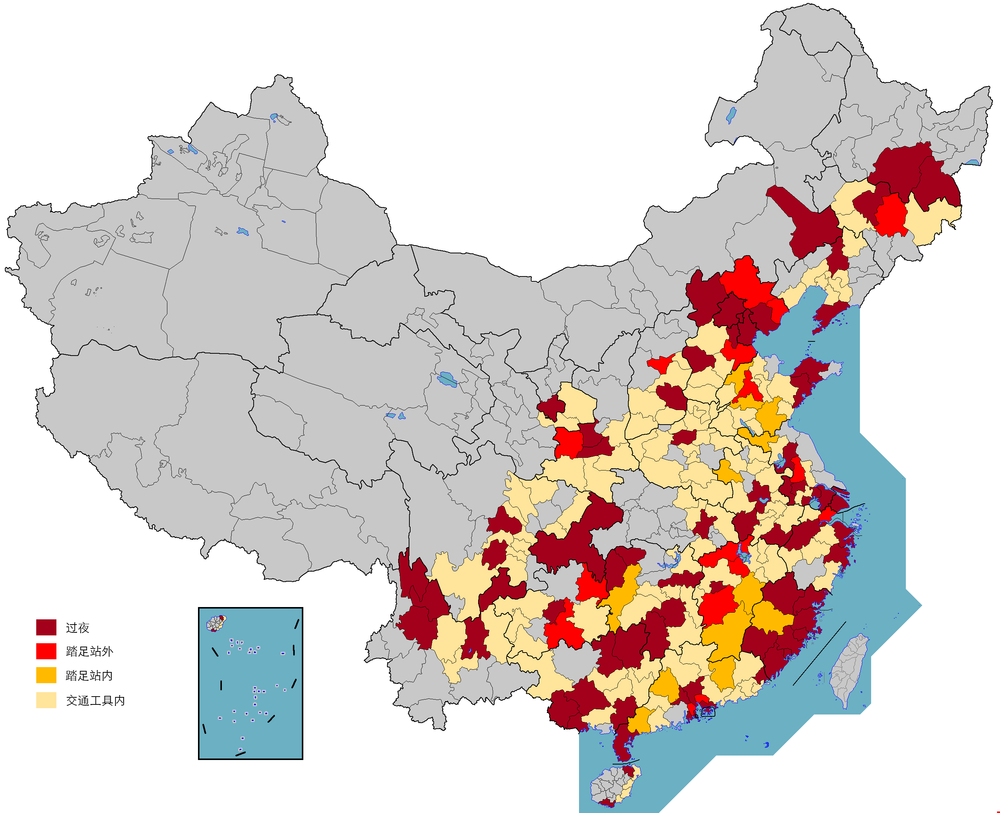

\>= County level. **bold**: overnight. normal: stepped outside station/airport/service area.

\>= City level. **_bold italic_**: stepped inside station/airport/service area. _italic_: inside vehicle.

# China

- **北京**（东城、**西城**、**朝阳**、丰台、石景山、**海淀**、房山、大兴、通州、**昌平**、怀柔、密云、**延庆**）
- **天津**（河西、河东、和平、**南开**、河北、红桥）
- **河北**
  - **石家庄**（**长安**、桥西、新华）、**唐山**（**路北**、**路南**、开平、丰南、丰润）、秦皇岛（昌黎）、**张家口**（**怀来**）、承德（兴隆）、沧州（任丘）、**廊坊**（广阳、安次、霸州、**永清**、香河）
  - _邯郸_、_邢台_、_保定_、_衡水_
- 山西
  - 太原（迎泽）、**长治**（潞州、**壶关**）
  - _阳泉_、_晋城_、_晋中_、_临汾_、_运城_
- **内蒙古**
  - **通辽**（**科尔沁**、科尔沁左翼中旗、科尔沁左翼后旗）
- **辽宁**
  - **沈阳**（和平、**沈河**、大东、皇姑、铁西）、**大连**（中山、**西岗**、沙河口）
  - _铁岭_、_辽阳_、_鞍山_、_营口_、_盘锦_、_锦州_、_葫芦岛_
- **吉林**
  - **长春**（**南关**、宽城、**朝阳**、二道、绿园、九台）、吉林市（昌邑、船营、蛟河）
  - _四平_、_松原_、_延边_
- **黑龙江**
  - **哈尔滨**（松北、**道里**、**南岗**、道外、平房、香坊）、**牡丹江**（西安、东安、阳明、**宁安**）
- **上海**（黄浦、**徐汇**、长宁、静安、**普陀**、虹口、**杨浦**、**闵行**、**宝山**、**浦东**、金山、**松江**）
- **江苏**
  - **南京**（玄武、秦淮、建邺、**鼓楼**、雨花台、江宁）、**无锡**（梁溪、锡山、江阴、**宜兴**）、**苏州**（**姑苏**、工业园）、**淮安**（**淮阴**）、扬州（邗江）、**镇江**（**京口**、**润州**）
  - **_徐州_**、_常州_、**_扬州_**、_镇江_、_泰州_、_宿迁_
- **浙江**
  - **杭州**（**上城**、下城、拱墅、西湖）、**宁波**（**海曙**、**慈溪**、江北）、嘉兴（南湖）、**台州**（黄岩）
  - _温州_、_湖州_、_绍兴_、_金华_、_衢州_
- **安徽**
  - **合肥**（蜀山、瑶海、庐阳、**包河**）、**安庆**（宜秀）、**黄山市**（**屯溪**、**歙县**）
  - _芜湖_、_蚌埠_、_马鞍山_、_铜陵_、_滁州_、**_阜阳_**、_宿州_、_六安_、_亳州_、_池州_、_宣城_
- **福建**
  - **福州**（**鼓楼**、台江、仓山、**马尾**、**晋安**、**长乐**、**闽侯**、**连江**、**永泰**、**平潭**、福清）、**厦门**（**思明**、湖里、集美、同安、翔安）、**莆田**（**城厢**、荔城、**秀屿**）、**泉州**（**丰泽**、鲤城、洛江、石狮、晋江、南安、惠安）、**漳州**（**长泰**、**东山**、芗城、南靖、龙海）、**南平**（延平、**武夷山**）、**龙岩**（**新罗**、永定、**长汀**）、**宁德**（**福鼎**）
  - **_三明_**
- 江西
  - 南昌（东湖、西湖）、九江（浔阳、濂溪）、**新余**（**渝水**）、吉安（吉州）
  - _景德镇_、_萍乡_、_鹰潭_、**_赣州_**、_宜春_、**_抚州_**、_上饶_
- **山东**
  - 济南（历下、市中、天桥）、**青岛**（**市南**、市北、崂山）、**烟台**（**芝罘**）
  - _淄博_、_枣庄_、_潍坊_、_济宁_、**_泰安_**、_日照_、**_临沂_**、**_德州_**、_聊城_、_滨州_、_菏泽_
- _河南_
  - **郑州**（**二七**、管城、金水、惠济、新郑）
  - _开封_、_洛阳_、_安阳_、_鹤壁_、_新乡_、_焦作_、_濮阳_、_许昌_、_漯河_、_三门峡_、_南阳_、_商丘_、_信阳_、_驻马店_
- **湖北**
  - **武汉**（江岸、江汉、硚口、汉阳、**武昌**、洪山）
  - _孝感_、_黄冈_、_咸宁_、_随州_
- **湖南**
  - **长沙**（**芙蓉**、**天心**、岳麓、开福、雨花、长沙县）、**衡阳**（**珠晖**）、**张家界**（永定、**武陵源**）、**永州**（冷水滩、**零陵**）、**湘西**（**凤凰**、吉首）
  - _株洲_、_湘潭_、_邵阳_、_岳阳_、_郴州_、**_怀化_**、_娄底_
- **广东**
  - **广州**（越秀、荔湾、海珠、**天河**、**白云**、番禺、花都、南沙、**从化**）、**深圳**（**罗湖**、福田、**南山**、宝安、龙岗、盐田、龙华、**坪山**、**光明**、深汕）、**珠海**（**香洲**）、**佛山**（**禅城**、顺德）、**湛江**（赤坎、**霞山**、麻章）、东莞（虎门）、中山（石岐、东区、西区、南朗）、**潮州**（**湘桥**、潮安）
  - _韶关_、_汕头_、**_佛山_**、**_茂名_**、**_肇庆_**、_惠州_、_梅州_、_汕尾_、**_河源_**、_阳江_、_清远_、_揭阳_、_云浮_
- **广西**
  - **南宁**（**青秀**）、**柳州**（**城中**、鱼峰、柳南、柳北）、**桂林**（秀峰、叠彩、**象山**、七星、阳朔）、**防城港**（港口、防城、**东兴**）、**玉林**（**玉州**）、**崇左**（**凭祥**）
  - _梧州_、_钦州_、_贵港_、_百色_、_贺州_、_来宾_
- **海南**
  - **海口**（龙华、**美兰**）、**三亚**（吉阳、**海棠**、**天涯**）
  - _琼海_、_文昌_、_万宁_、_陵水_
- **重庆**（**渝中**、江北、南岸、渝北、沙坪坝）
- **四川**
  - **成都**（武侯、**锦江**、青羊、金牛、**成华**、**新都**、双流、**都江堰**）、**乐山**（市中、**峨眉山**）
  - _自贡_、_德阳_、_绵阳_、_广元_、_内江_、_眉山_、_宜宾_、_广安_、_达州_、_资阳_、_凉山_
- **贵州**
  - **贵阳**（观山湖、**南明**、云岩、**花溪**）、铜仁、黔南（平塘）
  - _六盘水_、_毕节_、_黔西南_、_黔东南_
- **云南**
  - **昆明**（五华、**盘龙**、**官渡**、西山、呈贡、石林）、**昭通**（**永善**）、**丽江**（**古城**、玉龙、**宁蒗**）、**大理州**（**大理**）、**迪庆**（**香格里拉**）
  - _曲靖_、_玉溪_、_楚雄州_
<!--西藏-->
- **陕西**
  - **西安**（未央、**新城**、碑林、莲湖、**雁塔**、临潼）、宝鸡（渭滨）、**咸阳**（**秦都**、渭城）
  - _渭南_、_汉中_、_安康_、_商洛_
- _甘肃_
  - _平凉_、_庆阳_
<!--青海-->
- **宁夏**
  - **固原**（**原州**、泾源）
<!--新疆-->
- **香港**（中西区、湾仔区、东区、南区、**油尖旺区**、深水埗区、九龙城区、黄大仙区、**观塘区**、荃湾区、屯门区、元朗区、北区、沙田区、离岛区）
- **澳门**（花地玛堂区、**圣安多尼堂区**、望德堂区、大堂区、风顺堂区、路氹填海区）
<!--*台湾-->
### [5A](5A)

# United States

- **Alabama**
  - **Talladega National Forest**
- **Arizona**
  - Phoenix Sky Harbor International Airport, **Tucson**
- **California**
  - **Los Angeles**, **Pasadena**, **Inglewood**
  - **_San Francisco International Airport_**
- **Florida**
  - **Orlando**, Jacksonville, Tampa, St. Petersburg, Clearwater, Titusville, Daytona Beach, **Gainesville**, Micanopy, St. Augustine, St. Augustine Beach, Palatka, Cedar Key, Bronson, Crystal River, Tavares
- Georgia
  - Savannah
  - **_Hartsfield–Jackson Atlanta International Airport_**
- **Louisiana**
  - **New Orleans**，Vacherie
- **Massachusetts**
  - **Boston**
- _Mississippi_
- **_New Jersey_**
  - **_Newark Liberty International Airport_**
- **New York**
  - **New York City**
- **North Carolina**
  - **Charlotte Douglas International Airport**
- **Pennsylvania**
  - **State College**
- **South Carolina**
  - Charleston, Myrtle Beach, **Georgetown**, Murrells Inlet, Pawleys Island
- **Texas**
  - **Austin**, **San Antonio**, **Houston**, **Irving**
  - Dallas Fort Worth International Airport
- **_Virginia_**
  - **_Dulles International Airport_**
- **Washington**
  - **Seattle**

# United Kingdom

- **London**
- Oxfordshire
  - Oxford
- _Buckinghamshire_
- _Hertfordshire_
- _Bedfordshire_
- _Cambridgeshire_
- _Rutland_
- **Lincolnshire**
  - Lincoln, **Riseholme**, Nettleham, Skegness
- Derbyshire
  - Castleton
- Yorkshire
  - York, Hessle
- Nottinghamshire
  - Edwinstowe, Rufford

# South Korea

- **_Incheon_**
  - **_Incheon International Airport_**

# Singapore

- South East, **Central Singapore**, South West

### [World Heritage Sites](worldheritage)
